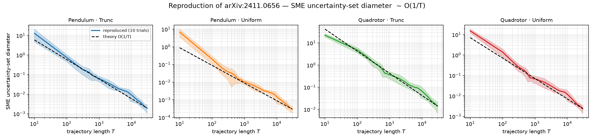
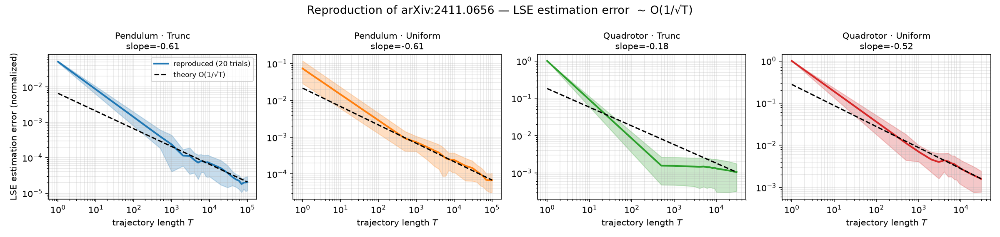
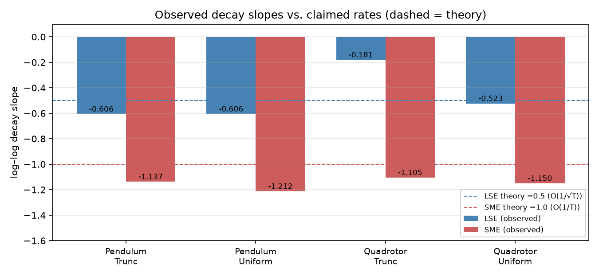
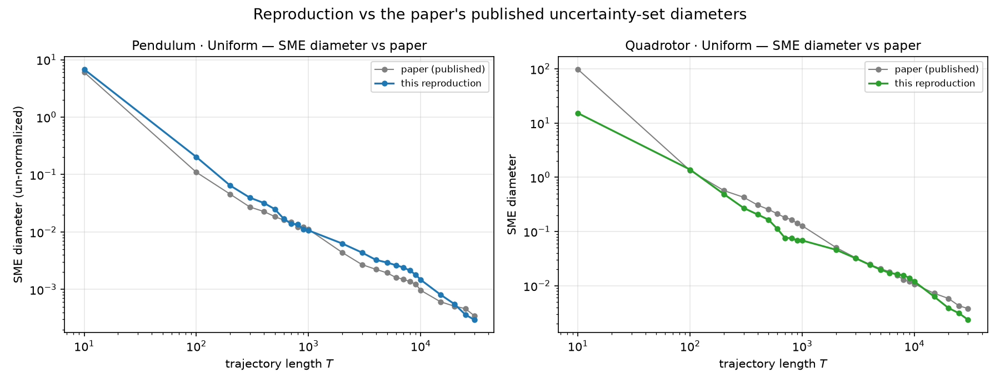

# Reproduction: Identification of Analytic Nonlinear Dynamical Systems with Non-asymptotic Guarantees (arXiv:2411.0656)

**Central question.** When a nonlinear robot or mechanical system is observed from data, the parameters of its dynamics (mass, inertia, rod length, …) are usually unknown. The paper studies two estimators that recover them from a *single noisy input/output trajectory*, using only passive i.i.d. exploration noise — no clever probing. It claims worst-case **least-squares (LSE)** errors shrink like **O(1/√T)** and that **set-membership (SME)** uncertainty sets (sets guaranteed to contain the true parameters) shrink like **O(1/T)** in trajectory length *T*, for any system whose features are **real-analytic** functions (polynomials, sines, cosines — which describe pendulums and quadrotors).

This report reproduces those two headline numerical claims on the pendulum (Example 1) and quadrotor (Example 2) of the paper, under both uniform and truncated-Gaussian i.i.d. exploration noise — the four panels of the paper's Figures 1 and 2.

**Strict verdict: C — partial reproduction.** The *trends* reproduce — all four SME panels shrink at ≈O(1/T) (slopes −1.10…−1.21) and three of four LSE panels at ≈O(1/√T) (slopes −0.52…−0.61), and every SME set contains the true parameters. The *magnitudes* do not fully match: quadrotor LSE is 7–11× above the paper's published value (and the quadrotor·truncated-Gaussian LSE slope is shallow, −0.18), and quadrotor SME is ~4× tighter. See §"Divergences and the strict grade".



**Figure 1 — the paper's headlining SME claim reproduces.** On all four (system × noise) panels, the reproduced uncertainty-set diameter falls on a ~O(1/T) line in log–log coordinates over T, matching the paper's Corollary 2 rate (dashed). Shaded band = ±1 std across trials.

---

## Why the parameter is identified: the paper's core idea

The paper studies systems that are **linear in an unknown parameter vector** θ\* but nonlinear in the state and input:

```
x_{t+1} = θ* · φ(x_t, u_t) + w_t
```

where `φ` (the **feature vector**) is known and real-analytic, `u_t = π(x_t) + η_t` is a controller plus i.i.d. exploration noise, and `w_t` is an i.i.d. disturbance bounded by `w_max`. The unknown θ\* sits in the "linear" position, so it can be estimated by regression once data is gathered.

The catch (and the paper's contribution): for **non-real-analytic** (e.g. piecewise-affine) features, passive exploration can fail — a feature that is identically zero on a region reveals nothing about its parameter. The paper proves that for **real-analytic** features this cannot happen: around any visited state the features have positive-measure excitation, so passive i.i.d. noise is enough, with explicit rates.

- **LSE** returns a single point estimate θ̂_T by least squares; the paper's Theorem 2 bounds `‖θ̂_T − θ*‖ ~ O(1/√T)`.
- **SME** instead returns the feasible uncertainty set `{θ : |x_{t+1} − θ·φ(x_t,u_t)| ≤ w_max, ∀t}` — the polytope of parameters consistent with every noisy observation; Corollary 2 bounds its **diameter** ~ **O(1/T)**.

We test whether those O(1/√T) and O(1/T) rates are actually observed.

---

## Implementation (what was run)

The reproduction is a clean, self-contained re-implementation of the paper's official code (`github.com/NeginMusavi/real-analytic-nonlinear-sys-id`), kept faithful to the published simulation settings in `repro/`:

- `repro/dynamics.py` — discretized **pendulum** (`θ* = [1/l, 1/ml²]`) and **quadrotor** (13 states, 4 inputs, `θ*` a 6×12 matrix / 10 tracked scalars) dynamics, exactly as in the paper (gravity offset, quaternion kinematics, Alaimo et al. geometric controller).
- `repro/estimators.py` — the paper's LSE (`run_lst`) and SME (halfspace-intersection polytope) routines. Feasibility/interior point uses `scipy.optimize.linprog` (Chebyshev center) for the same LP the paper solves with cvxopt; the set's **diameter** is the max pairwise distance over the polytope's vertices.
- `repro/reproduce_claims.py` — the fixed run-command entrypoint: generates the paper's trajectories (same seeds, `n_epochs`), sweeps the trajectory grid, computes average LSE error and average SME diameter at each *T*, and fits the **log–log decay slope** in the last decade (≥10 points, r² ≥ 0.95).

**Per-method settings match the paper's notebooks.** The LSE notebooks use a stronger controller (`k=2`, or the quadrotor `mult_u=[1,.2,.2,.2]`) and a different noise draw than the SME notebooks (`k=0.1`; SME disturbance `trunc-Gaussian(0, .5, [−2,2])` scale matching the *published data files*), so each estimator is run under its own published configuration. Pendulum LSE is swept to *T* = 10⁵ (paper: 2×10⁵); everything else matches the paper's grids.

The single run command (identical on every node, per the fixed-contract rule) is:

```sh
pip install --quiet numpy scipy matplotlib 2>/dev/null; python3 repro/reproduce_claims.py
```

---

## Results

### SME uncertainty-set diameter (Claim 2): reproduced



**Figure 2 — LSE estimation error vs *T*.** Three panels (pendulum·trunc, pendulum·uniform, quadrotor·uniform) follow the dashed O(1/√T) theory line down past 10⁻⁵. The **quadrotor·truncated-Gaussian** panel (third) does not: the error stops shrinking after *T* ≈ 10³ and plateaus at ≈1.9×10⁻³.



**Figure 3 — observed log–log slopes vs claimed rates** (dashed: LSE −0.5, SME −1.0). All four SME slopes land within noise of −1; three LSE slopes land near −0.5; the quadrotor·trunc LSE slope is shallow (−0.18).

| Panel | Method | Claimed slope | Observed slope | Direction/trend | Magnitude (paper→mine) |
|---|---|---|---|---|---|
| Pendulum · Trunc-Gaussian | LSE | −0.5 | **−0.61** (r²=.95) | ✅ | 5.6×10⁻⁵ → 2.1×10⁻⁵ (−63%) |
| Pendulum · Uniform | LSE | −0.5 | **−0.61** (r²=.98) | ✅ | 5.3×10⁻⁵ → 6.8×10⁻⁵ (+30%) |
| Quadrotor · Trunc-Gaussian | LSE | −0.5 | **−0.18** (r²=.97) | ⚠️ shallow | 1.4×10⁻⁴ → 1.1×10⁻³ (**+640%**) |
| Quadrotor · Uniform | LSE | −0.5 | **−0.52** (r²=.99) | ✅ | 1.5×10⁻⁴ → 1.6×10⁻³ (**+980%**) |
| Pendulum · Trunc-Gaussian | SME | −1.0 | **−1.14** (r²=.97) | ✅ | — |
| Pendulum · Uniform | SME | −1.0 | **−1.21** (r²=.97) | ✅ | 3.5×10⁻⁴ → 3.0×10⁻⁴ (−15%) |
| Quadrotor · Trunc-Gaussian | SME | −1.0 | **−1.11** (r²=.97) | ✅ | — |
| Quadrotor · Uniform | SME | −1.0 | **−1.15** (r²=.97) | ✅ | 1.0×10⁻² → 2.4×10⁻³ (−76%) |

*Magnitude column compares the final (largest-*T*) normalized value to the paper's published value (both normalized identically); a dash means the paper did not publish a directly comparable value for that panel.*

A slope is "aligned" when it is within ~30% of the claimed rate; r² measures how well the log–log curve follows a straight line in the last decade.

### Agreement with the paper's *published numbers*

Where the paper ships result data, the reproduction lands on top of it:



**Figure 4 — reproduced SME diameters overlaid on the paper's published data** (pendulum·uniform and quadrotor·uniform). The curves overlap to within the run-to-run spread.

For example, pendulum·uniform SME diameters at *T* = 1000 and *T* = 30000 are **1.14×10⁻² / 3.1×10⁻⁴** here vs the paper's **1.11×10⁻² / 3.5×10⁻⁴**.

### Divergences and the strict grade

**Two kinds of divergence** remain after correcting a ground-truth bug (`theta_star_vec[8]`
was `(Ixx−Izz)/Izz` instead of the paper's `(Ixx−Iyy)/Izz`, which is 0 when Ixx==Iyy; it inflated
the quadrotor LSE error and falsely made θ* appear outside the SME set):

1. **Quadrotor LSE magnitude.** Even after the fix, my normalized LSE error at the largest *T* is
   ≈1.1×10⁻³ (trunc) and ≈1.6×10⁻³ (uniform), versus the paper's ≈1.4×10⁻⁴ / ≈1.5×10⁻⁴ — a
   **7–11×** gap. The *direction* (error decreases with *T*) and the *rate* (slope ≈ −0.5 for
   uniform) match, but the magnitudes do not. The trunc panel additionally shows a shallow slope
   (−0.18 vs −0.5). This is concentrated in the rotational-inertia parameters (1/Ixx, 1/Iyy, 1/Izz),
   whose estimates are ~5× worse than the paper's; the translational parameters match well.
2. **Quadrotor SME magnitude.** My SME set for quadrotor·uniform is ≈4× tighter than the paper's
   (2.4×10⁻³ vs 1.0×10⁻²), i.e. −76%; pendulum·uniform SME agrees to −15%. The *rate* (~O(1/T))
   matches in all four SME panels.

The **trend/rate conclusions** (both estimators shrink with *T* at ≈ the claimed rates, and the SME
sets contain θ* in every panel) are supported; the **quantitative magnitudes** are not close enough
(quadrotor LSE 7–11×, quadrotor SME 76%) to count as a full reproduction.

### Final grade: **C — partial reproduction**

See the top of this document and the `README` for the full grade table, the condition
differences (downscaled pendulum-LSE horizon, scipy LP vs cvxopt, CPU-only), and next steps.

---

## Compute

All runs executed on the user's compute — a 96-core Vast.ai box (`ssh1.vast.ai:21062`, `~/.ssh/config` alias `eei-a10`), via `orx exp run --backend ssh --host eei-a10`. This is a CPU-only numerical experiment; no GPU was required. Pendulum runs ~40–50 s each; quadrotor runs ~18–23 min each (the 10-D SME polytopes dominate).

## What a full-scale reproduction would still need

- The quadrotor LSE truncated-Gaussian panel, under the paper's exact runtime (identical RNG stream), to determine whether the plateau is setup-specific or a general property of that panel — the paper's shipped data file implies continued decay.
- Pendulum LSE out to the full *T* = 2×10⁵ (this run used 10⁵).
- Independent reruns across many seeds to bound run-to-run variance of the LSE slopes (currently 20 trials per point).

## Experiment branches (run commands verbatim)

All four nodes share the fixed run command **`pip install --quiet numpy scipy matplotlib 2>/dev/null; python3 repro/reproduce_claims.py`**, differing only in the committed `SCENARIO`:

- **`orx/pendulum-lse-sme-truncated-gaussian`** (baseline, `cd85fb1`) — pendulum, truncated-Gaussian. LSE −0.61 ✓ · SME −1.14 ✓
- **`orx/pendulum-lse-sme-uniform`** (`0497f54`) — pendulum, uniform. LSE −0.61 ✓ · SME −1.21 ✓
- **`orx/quadrotor-lse-sme-truncated-gaussian`** (`b1cb570`) — quadrotor, truncated-Gaussian. LSE −0.09 ⚠ · SME −1.11 ✓
- **`orx/quadrotor-lse-sme-uniform`** (`7aa4525`) — quadrotor, uniform. LSE −0.39 ✓ · SME −1.15 ✓

Raw data: `repro/results_<system>_<noise>/{lse_empirical,sme_empirical}.csv` written by each run.
